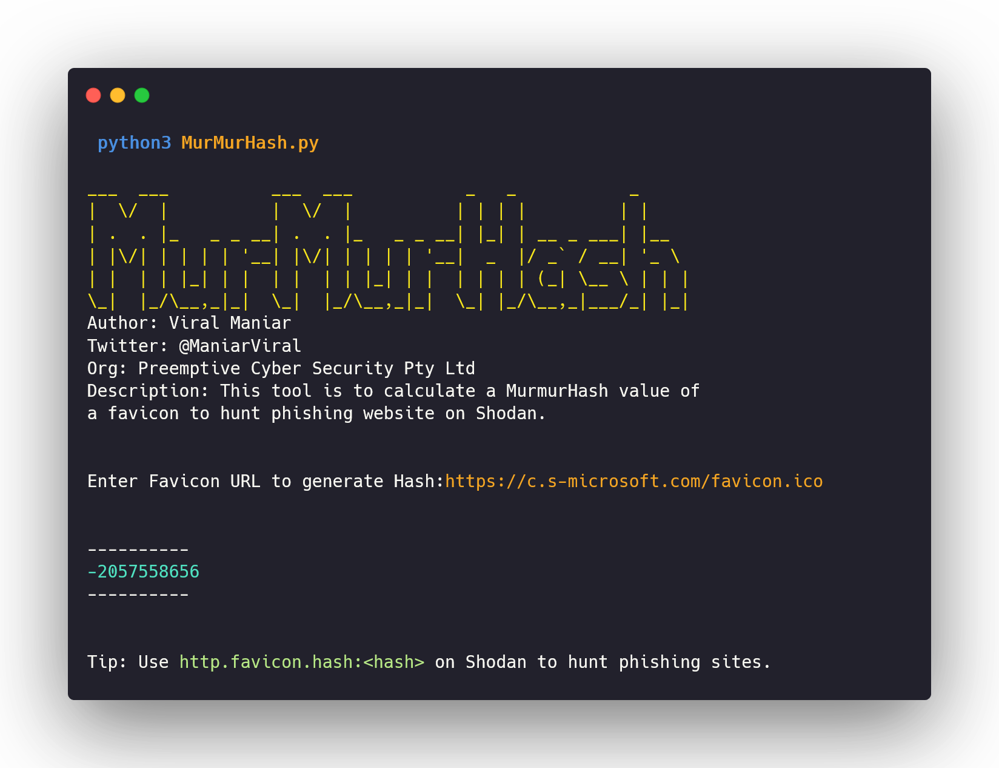
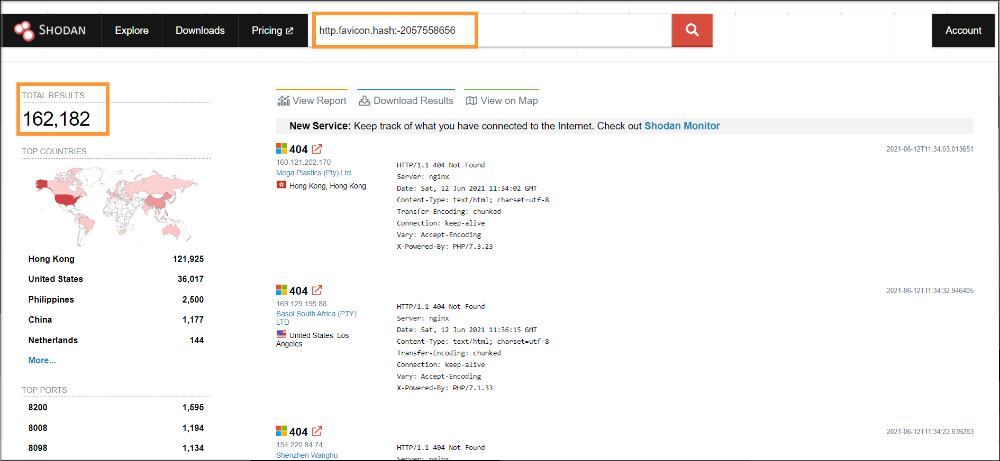

# Favicon Hashing

## What is a favicon?

The image/icon shown on the left-hand side of a tab is called as **favicon.ico**. This icon is generally fetched from a different source/CDN. Hence, we can find this favicon link from the source code of the website.


### How to find the favicon.ico link?

* Visit any website which already posses a favicon \([https://www.microsoft.com](https://www.microsoft.com/en-in)\)
* Now, view the source code and find the keyword "**favicon**" in the source code.
* You will find the link where the favicon is hosted. \([https://c.s-microsoft.com/favicon.ico](https://c.s-microsoft.com/favicon.ico?v2)\)

### Generating the MurmurHash value:

To generate the MurmurHash value which is unique to each favicon we will use a tool called **MurMurHash**

## **Tools:**

### \*\*\*\*[**MurMurHash**](https://github.com/Viralmaniar/MurMurHash)\*\*\*\*

* **Author**: [Viral Maniar](https://github.com/Viralmaniar)
* **Language**: Python

**MurMurHash** is a simple tool used to generate hash for the given favicon.

### Installation:

```bash
git clone https://github.com/Viralmaniar/MurMurHash.git
cd MurMurHash/
pip3 install -r requirements.txt
```

### Running: 

* Upon running the tool, it will ask you to enter the URL for the hash.
* And after entering the favicon link it will provide you with a unique hash value \(**-2057558656**\) 

```bash
python3 MurMurHash.py
```



### 

### Weaponizing through Shodan:




