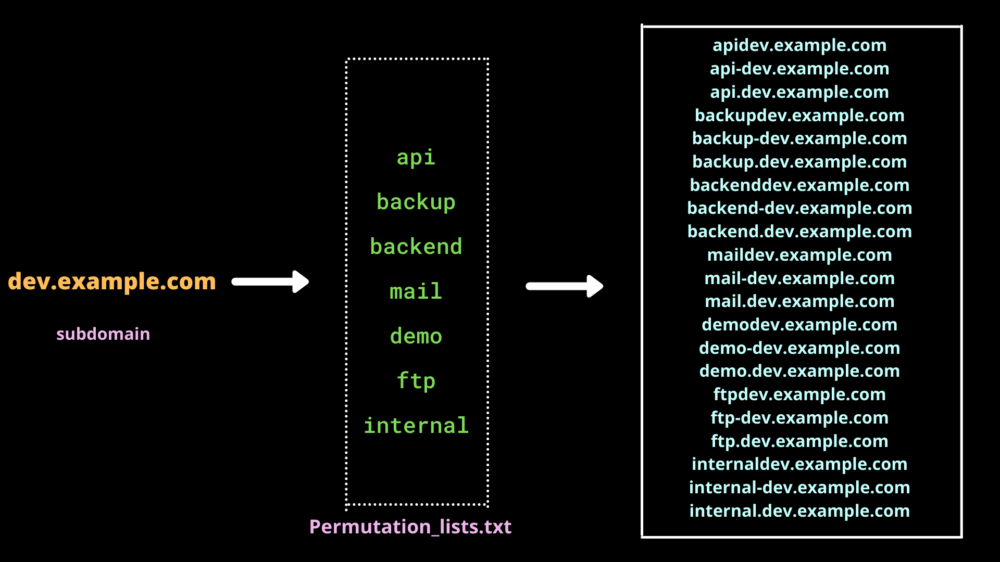
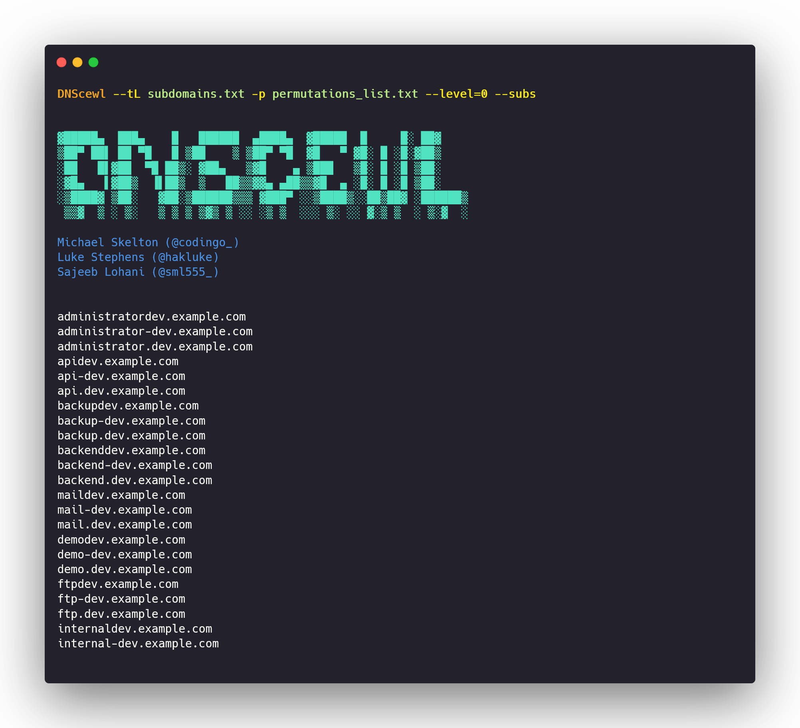

# Permutation/Alterations

It is almost similar to the previous DNS wordlist bruteforcing but instead of simply performing a dictionary attack we generate combinations/permutations of the already known subdomains.

One more thing to be noted here is, we also need a small wordlist with us in this method, which would contain common words like `mail` , `internal`, `dev`, `demo`, `accounts`, `ftp`, `admin`\(similar to DNS bruteforcing but smaller\)  
  
For instance, let's consider a subdomain **`dev.example.com`** . Now we will generate different variations/permutations of this domain.



Isn't it good that we can generate such great combinations? This is the power of permutation bruteforcing. Now that we have generated these combinations, we further need to DNS resolve them and check if we get any valid subdomains. If so it would be a WIN ! WIN ! 🏁 situation for us. 

## Tools:

### 
[DNSCewl](https://github.com/codingo/DNSCewl)

* **Author:** [codingo](https://github.com/codingo)
* **Language**: C++

DNSCewl as the name suggests is a DNS wordlist generator. It is used to generate various combinations or permutations of a root domain with the user-supplied wordlist. Capable of generating 1M combinations in almost 2 secs.

### Installation:

* First, we need to download the binary.
* Then move the binary to the user's PATH so that it can be accessed from anywhere.

```bash
wget https://github.com/codingo/DNSCewl/raw/master/DNScewl
chmod 755 DNScewl
mv DNScewl /usr/bin/DNScewl
```

### Running:

* First, we need to make a single list of all the subdomains\(valid/invalid\) we collected from all the above steps whose permutations we will create.
* To generate combinations you need to provide a small common words list too.
* [This](https://gist.githubusercontent.com/six2dez/ffc2b14d283e8f8eff6ac83e20a3c4b4/raw) is a good wordlist of 1K permutation words that we will need.
* The below command generates a huge list of non-resolved subdomains.

```text
DNScewl --tL subdomains.txt -p permutations_list.txt --level=0 --subs --no-color | tail -n +14  > permutations.txt
```

#### Flags:

* **tL** - Specify subdomain list
* **p** - Specify permutation/append list 
* **level=0** - Intensity of permutation, doesn't use "-"
* **subs** - Generate subdomains
* **no-color** - No colorized output



### 

### Resolution:

* Now that we have made a huge list of all the possible subdomains that could exist, now it's time to DNS resolve them and check for valid ones.
* For this, we will again use [Puredns](https://github.com/d3mondev/puredns).
* It always better to generate fresh public DNS resolvers every time we use them.

```bash
puredns resolve permutations.txt -r resolvers.txt
```

**Flags:**

* **resolve** - Use resolution mode
* **r** - public DNS resolvers list

In such a way, we have got those strange name subdomains and increased our attack surface.

### 


  
 

