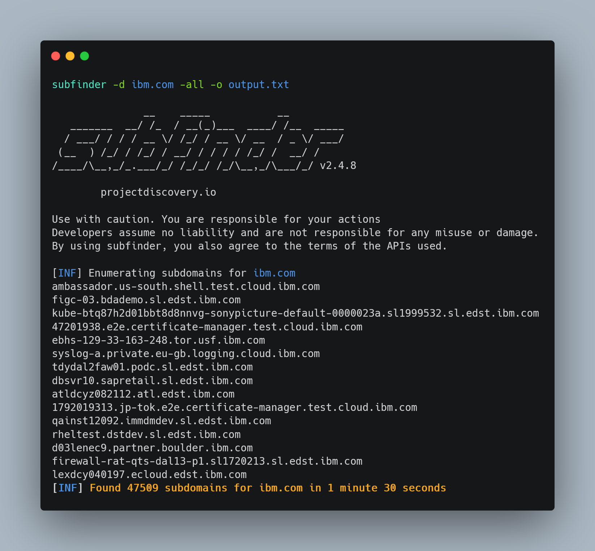
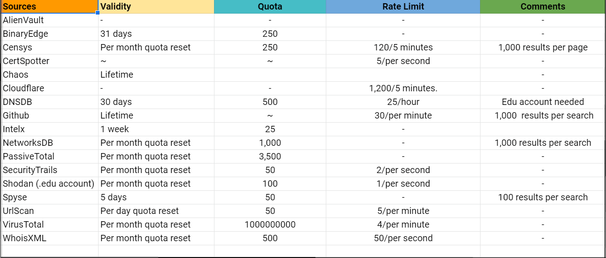
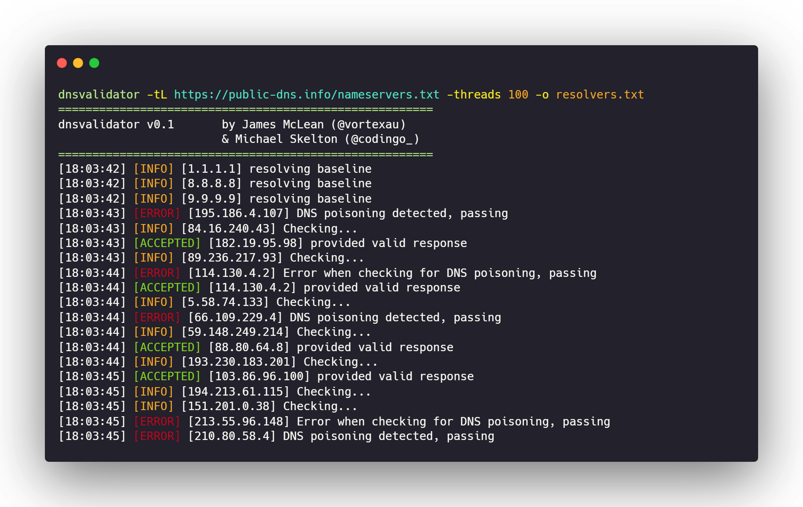

# Prerequisites

### What things do we need before performing a great enumeration?

1. **API keys of Passive DNS sources**
2. **100% accurate open public DNS resolvers**
3. **A VPS\(Virtual Private Server\)**


## 1\) API keys for Passive DNS data 🔑 

### What is Passive DNS data?

Whenever a domain is alive on the internet, to access it, a DNS query needs to be made to the DNS resolver. With special probes activated on the DNS resolver, it is possible to record these queries. This doesn't record which client made the request but, just the fact that at some point a domain has been associated with a specific DNS record.

Hence, we can know, what were the subdomains of a particular root domain that once existed in DNS records. These subdomains in the present time may be alive or dead. \(we need further find out which are the valid ones\). Along with these various companies have their internet crawlers which continuously keep on crawling the whole internet and discover new assets.

There are a number of services/sources\([Security trails](https://securitytrails.com/), [Censys](https://censys.io/), [Spyse](https://spyse.com/), [Shodan](https://www.shodan.io/), [Whoisxmlapi](https://www.whoisxmlapi.com/), [DNSDB](https://www.farsightsecurity.com/tools/dnsdb-scout/)\) that provide such historical DNS data. These services provide their API keys so that we can query their enormous data sets. 

### Configuring API keys: 

**There are 2 types of passive DNS sources:-**

**1\) Allow querying their Datasets freely**  
A number of sources allow users to freely query their DNS datasets. Check out which sources allow to freely query their dataset here. \(we don't need to care about these sources as our subdomain enumeration tools like ****[**amass**](https://github.com/OWASP/Amass), ****[**subfinder**](https://github.com/projectdiscovery/subfinder), [**assetfinder**](https://github.com/tomnomnom/assetfinder) will query them and do the work for us😋 \)

**2\) Need to make API keys to query Datasets**  
Also, a number of sources require you to signup on to their platform and generate a unique API key for yourself so that you are authorized to query and retrieve their historical datasets.

### Problems with obtaining free API keys of good passive sources:

* Good passive sources provide API keys for a limited period. \(7 days/20 days\)
* They provide a limited amount of API query quota. \(50 per day/1000 per month \)
* Limited query results \(2 pages of data\)

### Is it worth making API keys?

* Yes, absolutely, given below is the comparison between running [**Subfinder** ](https://github.com/projectdiscovery/subfinder)with API keys configured and without.
* You can clearly see the difference that using API keys gave me **20000 more** subdomains.
* Further, this passive data would be used to generate permutation/alterations which eventually would give us more subdomains.











### How much times does it takes to signup and obtain API keys:

* There are in total 19 services on which you can sign up and obtain API keys.
* I have created a detailed excel sheet about which sources to signup on for, what's the validity of API key, their API key quota, rate limits, etc.
* Depending on your consumption of API queries and the validity of API keys, you need to make keep making new accounts at a regular interval of time in order to get the maximum results.



💁♂ **Check out the excel sheet** 👉 ****[**here** ](https://docs.google.com/spreadsheets/d/1w75gcdytSRtZqGHMo852x2ffl8CC4FhxmHzR0gvII-Y/edit?usp=sharing)\*\*\*\*👈 ****


**More the time** you invest in signing up with passive sources, **More the subdomains** you get ✨


## 2\) 100% accurate open public DNS resolvers

### What is a DNS resolver?

A DNS\(Domain Name System\) resolver is a service that manages "name to IP address" translations. The process of DNS resolution involves converting a hostname \(such as www.example.com\) into a computer-friendly IP address \(such as 192.168.1.1\). In short, we get to know whether a domain is alive or not when we query a DNS resolver.

### Why do we need a public DNS resolvers list?

During various subdomain enumeration techniques like bruteforcing or resolution of a large number of domains, we use a base tool called MassDNS. MassDNS is a simple high-performance tool that is used to check whether a domain is valid/alive or not. For this purpose, MassDNS needs to be provided a list of public DNS resolvers. These public resolvers perform DNS queries and check for validation of a domain. Hence, more the number of public resolvers provided, the more concurrent DNS queries are made and thus faster the execution.  


### How can we create a list of public resolvers?

[**Dnsvalidator**](https://github.com/vortexau/dnsvalidator) is a tool that helps us to generate a valid list of open public DNS resolvers.[https://public-dns.info](https://public-dns.info/) is a web service that includes around 1.5k public DNS resolvers. But some of these wouldn't be working. So, dnsvalidator helps us to verify only the valid open public DNS resolvers. Dnsvalidator takes this list of 1.5k public resolvers and queries for its resolution using trusted resolvers like Google DNS\(8.8.8.8\), Cloudflare DNS\(1.1.1.1\), Quad9\(9.9.9.9\).

```bash
git clone https://github.com/vortexau/dnsvalidator.git
cd dnsvalidator/
python3 setup.py install
dnsvalidator -tL https://public-dns.info/nameservers.txt -threads 100 -o resolvers.txt
```



## 3\) A VPS \(_Most Preferable\)_

### What is a VPS?

VPS\(Virtual Private Server\) can be called as your own dedicated virtual machine in the cloud. 

### Benefits of a VPS?

VPS tends to have higher bandwidth and better DNS resolution capabilities as compared to your local home system which uses ISP's DNS resolver which are slow.

A VPS helps while performing various bandwidth-intensive tasks such as DNS resolution & brute-forcing. Alongside when performing such tasks on a local system generally blows up your wifi making it unusable for other users connected on the same network.

Also, you can perform tasks 24/7; 365 days in a VPS, unlike your local system.

### How to get one?

There are various cloud providers that provide **free 100$ credits** like [Digital Ocean](https://www.digitalocean.com/), [Linode](https://www.linode.com/), [Vultr](https://www.vultr.com/) when you signup for the first time.\(CC required\)  
**Referral Links:**

[](https://www.digitalocean.com/?refcode=9961f826b4d3&utm_campaign=Referral_Invite&utm_medium=Referral_Program&utm_source=badge)

* [Linode](https://www.linode.com/?r=3e95d563ede9af9901189e9476917c9338b7108f)
* [Vultr](https://www.vultr.com/promo/try100)

  
****


