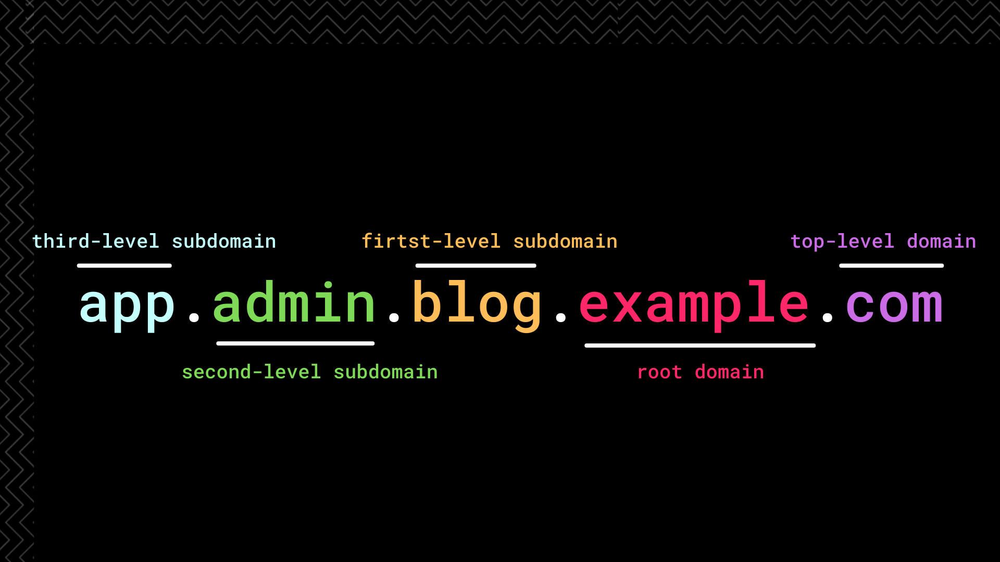

# What's the need?🤔

## **What is subdomain enumeration?**

It is one of the most crucial parts of the reconnaissance phase while performing a security assessment. **Subdomain Enumeration** is a process of finding sub-domains of one or more root domains.  According to [RFC 1034](https://tools.ietf.org/html/rfc1034), "_a domain is a subdomain of another domain if it is contained within that domain_".

## What's the need?

* Performing subdomain enumeration via various intensive techniques can help enlarge your attack surface as you get more subdomains to find vulnerabilities on.
* A good subdomain enumeration will help you find those hidden/untouched subdomains, where your competition to find bugs will also be less. Hence lesser **duplicates**.
* Finding applications running on hidden, forgotten\(by the organization\) sub-domains may lead to uncovering critical vulnerabilities.
* Discovering such strangely named subdomains is a critical skill, each bug hunter should possess in today's time.
* For large organizations, to find what services have they exposed to the internet.


**More the subdomains = More the vulnerabilities.**


## ⚠ Common Misconception about "subdomain" 

A Fully Qualified Domain Name \(**FQDN**\) is the complete domain name for a specific computer, or host, on the internet.

An FQDN looks like this:-

`myhost.example.com.`   **----&gt;** Fully Qualified Domain Name 

 `myhost` **----&gt;** is the host located within domain example.com \(subdomain\)

**Hence;**  
[https://example.com](https://example.com)  
[http://myhost.example.com](http://myhost.example.com)  
[https://internal.accounts.example.com  ](https://internal.accounts.example.com%20%20)  
[http://internal.accounts.dashboard.example.com](https://internal.accounts.dashboard.example.com)

The above-mentioned **cannot** be called as subdomains. They are web applications hosted on ports 80 & 443 of their respective hosts. Most people have a misconception that these are subdomains of a particular target.

Let's consider an example, **`admin.example.com`**  is a subdomain on which there may not exist a web service hosted on port 80 & 443. That means when we send `admin.example.com` to [httpx](https://github.com/projectdiscovery/httpx)/[httprobe ](https://github.com/tomnomnom/httprobe)\(tools that check whether any web app running on port 80/443\), it will not return any output.

This doesn't mean that `admin.example.com` is not a valid subdomain of root domain `example.com`There may be web services hosted on them but not on the default ports\(80/443\). Also, there may be some other **vulnerable services** running on the subdomain whose exploits are publicly available.   
  
So in such a case, it's always better that you **DNS resolve** the subdomain rather than **web probing** them.

### **Moral of the story:**

The methodology of collecting subdomains from tools like amass, subfinder, findomain and directly sending them to httpx/httprobe is **absolutely wrong**❌. Instead, you should DNS resolve them using tools like [puredns ](https://github.com/d3mondev/puredns)or [shuffledns](https://github.com/projectdiscovery/shuffledns).   

  

