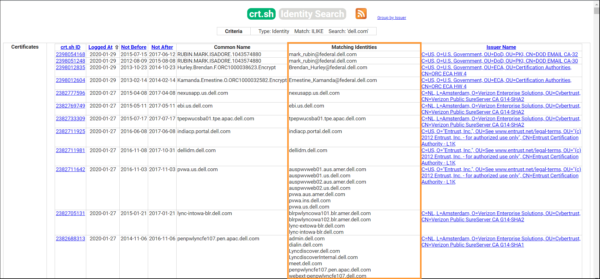

# Certificate Logs

## What are SSL/TLS certificates?

SSL/TLS certificates are obtained to help a website move from "HTTP" to "HTTPS" which is more secure. This certificate is trusted by both the domain presenting the certificates and the clients that use the certificate to encrypt their communications with the domain’s services. To obtain such a certificate we need to request it from the CA(Certificate Authority).

### What was the need to implement Certificate Transparency Logs?

Before 2013 these CA(Certificate Authority) authorities faced various breaches. Due to such breaches, anyone could maliciously create a forged certificate of the domain owner and gain the trust of the end-user. Also, CA didn't perform proper verifications if the requester is an authorized person of the domain. Hence, there was a need to create a transparent common system for all.&#x20;

## What is Certificate Transparency Log?

Google came up with a unique solution to this problem, by introducing transparent audit logs for Certificate Authorities in order to protect the integrity. This means that all the certificates issued by the CA would be appended to a common public list. Having a transparent log of all issued certificates is a great solution for solving the problem of fraudulent certificate issuing, as legitimate domain owners have the ability to spot certificates issued without their consent.

### How CT logs can be abused?

Since every time an organization gets an SSL certificate it gets logged in these CT logs, they can be abused easily. As anyone can query them, thus can be utilized to enumerate the subdomains of a root domain that have an accompanying TLS certificate.&#x20;

We can find all SSL certificates belonging to a domain by issuing a GET request to [**https://crt.sh/?q=%25.dell.com**](https://crt.sh/?q=%25.dell.com)****



As you can see we got a list of subdomains.

## Tool:

### 1) [CTFR](https://github.com/UnaPibaGeek/ctfr)

* **Author**: [UnaPibaGeek](https://github.com/UnaPibaGeek)
* **Language**: Python

This is a simple tool that grabs all the domains from **crt.sh**.

**Installation:**

```
git clone https://github.com/UnaPibaGeek/ctfr.git
cd ctfr/
pip3 install -r requirements.txt
```

**Running CTFR:**

```
python3 ctfr.py -d target.com -o output.txt
```

**Flags:**

* **d** - target
* **o** - output

### **2) One-liners:**

* These are bash onliners to enumerate subdomain through certificates.

```
curl "https://tls.bufferover.run/dns?q=.dell.com" | jq -r .Results[] | cut -d ',' -f4 | grep -F ".dell.com" | anew -q output.txt
```

```bash
curl "https://dns.bufferover.run/dns?q=.dell.com" | jq -r '.FDNS_A'[],'.RDNS'[]  | cut -d ',' -f2 | grep -F ".dell.com" | anew -q output.txt
```

