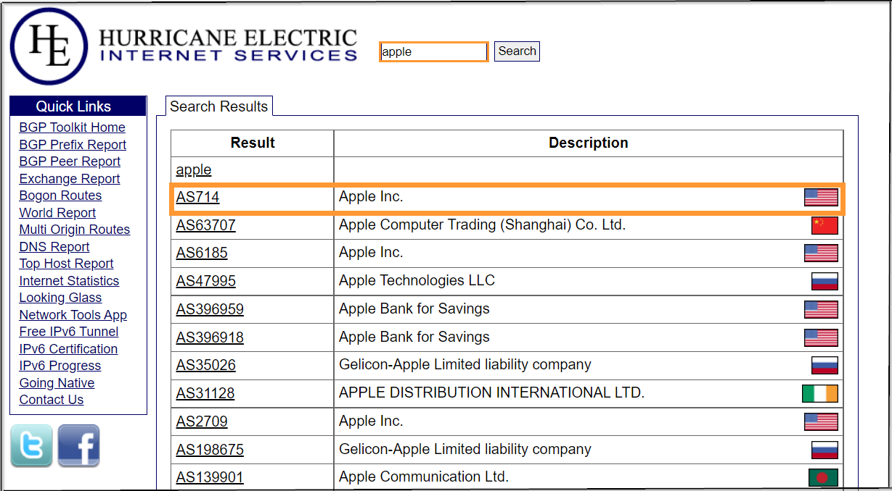
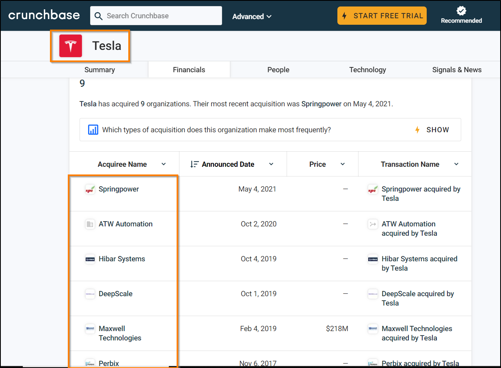

# Horizontal Enumeration

While performing a security assessment our main goal is to map out all the domains owned by a single entity. This means knowing all the assets facing the internet of a particular organization. It is trickier to find related domains/acquisitions of a particular organization as this step cannot be automated. One has to solely perform manual analysis.  

From the below image you can get an idea of what a **horizontal domain correlation** is:


  
Let's look at how to find related domains.

## Methods:


These enumeration methods can go out of scope and backfire you


### 1\) Discovering the IP space

ASN\(Autonomous System Number\) is a unique identifier of certain IP prefixes. Very large organizations such as Apple, Github, Tesla have their significant IP space. To find an ASN of an organization [https://bgp.he.net](https://bgp.he.net/) is a useful website where we can query.  
Let's find ASN for **Apple Inc.**



Now that we have found out the ASN number, next we need to figure out IP ranges within that ASN. For this, we will use **whois** tool.

```bash
whois -h whois.radb.net  -- '-i origin AS714' | grep -Eo "([0-9.]+){4}/[0-9]+" | uniq
```


### 2\) Finding related domains/acquisitions

**WhoisXMLAPI** is an excellent source that provides a good amount of related domains & acquisitions based on the whois record. Singing up on their platform will assign you **500 free credits** which renew every month.  
Visit [https://tools.whoisxmlapi.com/reverse-whois-search](https://tools.whoisxmlapi.com/reverse-whois-search) . Now searching with the root domain name like **dell.com** will give all the associated domains.



These are not 100% accurate results, they contain false positives


### Paid tools: 💰 

[**Crunchbase**](https://www.crunchbase.com/) is another great alternative for finding acquisitions but requires a paid subscription to view all the acquisitions. But the trial version allows viewing some of the acquisitions.



### 

### 3\) PTR records \(Reverse DNS\)

Now since we have got to know the IP address ranges from ASN of an organization, we can perform PTR queries on the IP addresses and check for valid hosts.  
  
**What is reverse DNS?**  
When a user attempts to reach a domain name in their browser, a DNS lookup occurs, matching the domain name\(example.com\) to the IP address\(such as 192.168.1.1\). A reverse DNS lookup is the opposite of this process: it is a query that starts with the IP address and looks up the domain name.

This means that, since we already know the IP space of an organization we can, we can reverse query the IP addresses and find the valid domains. Sounds cool?

**But how?**  
PTR records \(pointer record\) helps us to achieve this. Using [**dnsx**](https://github.com/projectdiscovery/dnsx) ****tool we can query a PTR record of an IP address and find the associated hostname/domain name.

**Apple Inc.** 🍎  has **ASN714** which represents IP range **17.0.0.0/8.** So, let's see have to perform reverse DNS.

### Running:

We will first need to install 2 tools:

* [**Mapcidr**](https://github.com/projectdiscovery/mapcidr) **** :- `GO111MODULE=on go get -v github.com/projectdiscovery/mapcidr/cmd/mapcidr`
* \*\*\*\*[**dnsx** ](https://github.com/projectdiscovery/dnsx)       :- `GO111MODULE=on go get -v github.com/projectdiscovery/dnsx/cmd/dnsx`

```bash
 echo 17.0.0.0/8 | mapcidr -silent | dnsx -ptr -resp-only -o output.txt
```

#### Breakdown:

* When an IP range is given to **mapcidr** through stdin\(standard input\), it performs expansion spitting out each IP address from the range onto a new line:`17.0.0.1`**,** `17.0.0.2`**,** `17.0.0.3`**,** `17.0.0.4`
* Now when **dnsx** receives each IP address from stdin, it performs reverse DNS and checks for PTR record. If, found it gives us back the hostname/domain name.


####   

