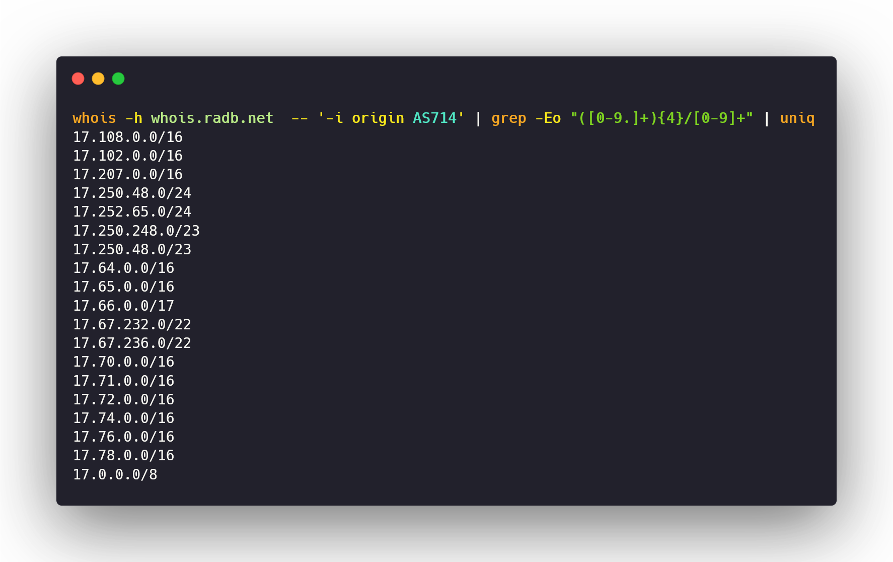

# Horizontal Enumeration


While performing a security assessment our main goal is to map out all the domains owned by a single entity. This means knowing all the assets facing the internet of a particular organization. It is trickier to find related domains/acquisitions of a particular organization as this step cannot be automated. One has to solely perform manual analysis.  

From the below image you can get an idea of what a **horizontal domain correlation** is.


gmail.com, android.com, youtube.com, blogger.com are all associated domains of Google   
  
Let's look at how to find related domains.

## 

## Methods:


These enumeration methods can go out of scope and backfire you


### 1\) Discovering the IP space

ASN\(Autonomous System Number\) is a unique identifier of certain IP prefixes. Very large organizations such as Apple, Github, Tesla have their significant IP space. To find an ASN of an organization [https://bgp.he.net](https://bgp.he.net/) is a useful website where we can query.  
Let's find ASN for **Apple Inc.**


Now that we have found out the ASN number, next we need to figure out IP addresses associated with that ASN. For this, we will use **whois** tool.

```bash
whois -h whois.radb.net  -- '-i origin AS714' | grep -Eo "([0-9.]+){4}/[0-9]+" | uniq
```



### 2\) Finding related domains

**WhoisXMLAPI** is an excellent source that provides a good amount of related domains & acquisitions based on the whois record. Singing up on their platform will assign you **500 free credits** which renew every month.  
Visit [https://tools.whoisxmlapi.com/reverse-whois-search](https://tools.whoisxmlapi.com/reverse-whois-search) . Now searching with the root domain name like **dell.com** will give all the associated domains.


