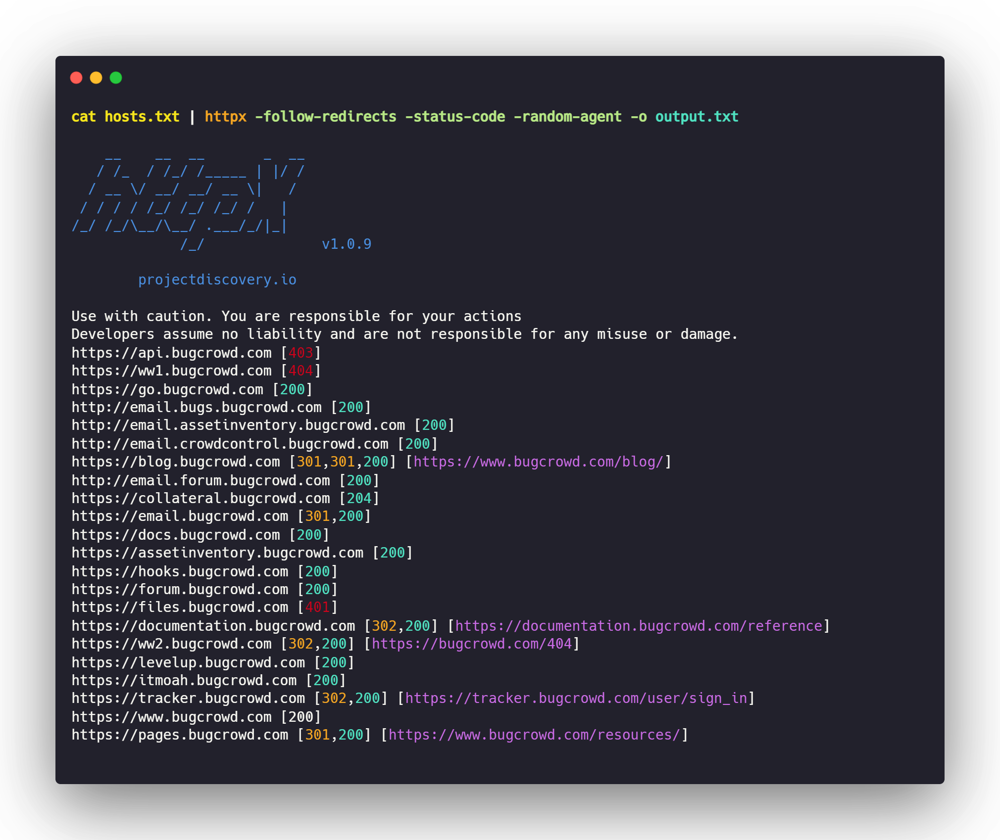

# Web probing

Another important aspect of subdomain enumeration is identifying web applications hosted on those subdomains. Most people perform pentesting on web applications only hence their accurate identification/discovery is essential. 

Port **80 & 443** are the default ports on which web applications are hosted. But one must also check for web applications on other common web ports. Most times something hosted on other common ports is very juicy or paid less attention by organizations.

## Tools

### [HTTPX](https://github.com/projectdiscovery/httpx)

* Author: [projectdiscovery](https://github.com/projectdiscovery)
* Language: Go

**Httpx** is a fast multi-purpose toolkit that allows running multiple HTTP probers and find for web applications on a particular port. \(find hosts ?\)  
Httpx is a highly configurable tool, which means it provides a ton of flags. So, users can get a highly customizable output as per their needs.

### Installation:

```bash
GO111MODULE=on go get -v github.com/projectdiscovery/httpx/cmd/httpx
```

### Flags:

* **follow-redirects -** Follows redirects \(can go out-of-scope\)
* **follow-host-redirects -** Follows redirects if on the same host \(helps to be in-scope\)
* **random-agent -** Uses a random user-agent for each request
* **status-code -** Shows the status code
* **retries** - Number of times to retry if response not received
* **o** - Output file



## Probing on default ports:

By default, [**httpx** ](https://github.com/projectdiscovery/httpx)will probes on port **80**\(HTTP\) & **443**\(HTTPS\). Organizations host their web applications on these ports. After subdomain enumeration, the next first task is identifying web applications where vulnerabilities are found in abundance.

```bash
cat subdoamins.txt | httpx -follow-host-redirects -random-agent -retries 2 -o output.txt
```

## Probing on common ports:


  


  


